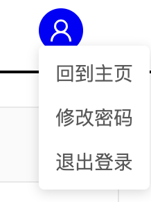
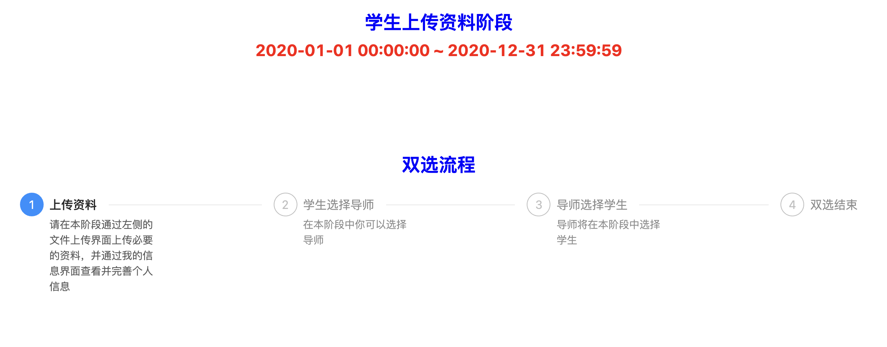
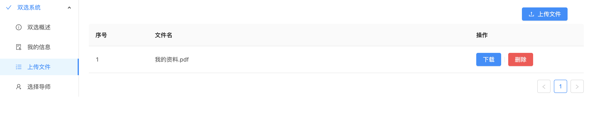
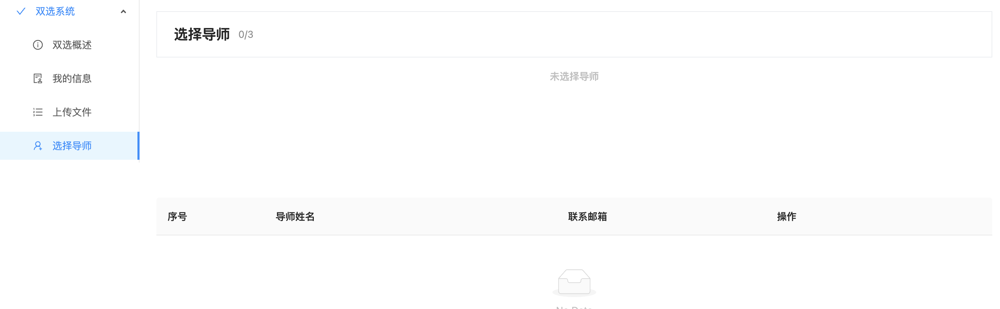

# 使用手册--双选系统学生端

## 登录系统

请输入登录账号和初始密码登录系统。初次登录系统后，请尽快重设你的密码。

重设密码的按钮位于页面右上角：

## 首页-双选概述
在这个界面中，你将可以看到当前双选的流程简介。如下图所示：

接下来，将会对双选的流程做简单说明

+ 第一阶段：学生上传资料阶段
  
  在这一阶段中，你需要在“上传文件”栏目中上传指定的文件，具体的文件列表请参照学院给出的其他公告。

  注意，你只能够在这个阶段上传文件，并且可以上传文件的时间也会受到限制。

  根据约定，上传的资料中可以有``jpg, png, pdf``类型文件，文件大小不超过50M。不满足要求的文件将会被自动拒绝上传。此外，上传文件的次数以及文件的数量不会受到限制，你也可以对已经上传的文件作出“删除”处理。

+ 第二阶段：学生选择导师阶段
  
  在这个阶段中，你将可以选择最多3名导师，并且按照志愿顺序对这三名导师进行排序。

  请注意，你的专业以及学生类型（例如，``软件工程 学硕``）将会影响你可以选择的老师。

  你对三名导师的“志愿”顺序将会影响你被对应老师查看并选择的优先级，具体影响请看下文。

+ 第三阶段：导师选择学生阶段
  
  在这个阶段中，导师将会根据你的志愿顺序对你进行排序。

  整个阶段可以分为三次选择，在老师第一次选择中，你将会被推送到你的“第一志愿”老师的选择列表中。如果该老师选择了你，那么恭喜你，你已经被该老师选择了（后面的两个志愿不会影响到你）。但如果很不幸，该老师没有选择你的话，那么你就只能等待老师的第二次选择，进入到“第二志愿”老师的选择列表中。以此类推，由于你一共有三个志愿老师，因此这样的选择将会重复三次。

  注意，导师选择学生是根据你的专业以及学生类型的，并且，导师选择学生的数量也是有限制的。比如，如果你的第二志愿老师的名额已经选满了，而你的第一志愿老师没有选择你，那么即使你在第二次选择中进入到了第二志愿老师的选择列表，那么老师也无法选择你了。因此，请谨慎决定志愿顺序，最好在选择老师前先与老师进行联系。

+ 第四阶段：双选结束阶段
  
  如果你在第三阶段中成功被你的导师选择，那么说明你“双选成功”了，在这个阶段中，你只需要等待数据迁移到“考勤系统”当中即可。你可以在考勤系统中看到你的导师信息。

  如果很不幸，你在第三阶段中没有被任何导师选择，那么请尽快联系学院相关工作小组。

## 信息界面

你可以在信息界面中上传自己的照片，并且更新自己的联系邮箱和手机号码。如果你发现其他已经记录在系统中的信息是不正确的，或者已经过时，那么请联系相关工作人员进行修改。

## 上传文件

在上传文件界面中，你可以上传``pdf, jpg, png``类型的文件。但请注意，你只能够在“学生上传资料阶段”并且满足时间的情况下上传文件，不满足此要求时，上传和删除文件的操作将会被拒绝。当然，下载文件是不受到限制的。

## 选择导师

你可以在这个界面选择导师，下方是你可以选择的导师列表，你可以在上方查看你已经选择的导师并且调整志愿顺序。

