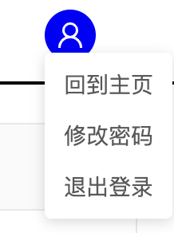

# 使用手册--考勤系统学生端

## 登录系统
请输入登录账号和密码登录系统。

登录后，将会根据学生身份来进入到考勤系统。

注意，如果你发现自己处于“双选系统”，那么有两种情况
1. 双选数据还没导入，需要等待数据导入考勤系统
2. 确实出bug了，请联系相关工作人员

## 考勤系统

学生可以在考勤系统中修改自己的个人信息（个人信息不是必需的），并且查看自己的导师名（用于新的研究生从双选系统进入到考勤系统时展示自己的导师）。

另外，学生可以在考勤系统中查看讲座列表，并且对自己的签到情况进行查看。

如果你忘记某次签到了，你可以联系相关工作人员帮忙补签。

## 修改密码、登出

修改密码和登出功能位于界面右上角的图标下拉栏中：

目前，修改密码不需要验证已有的密码，要求的新密码规则为8～20个字符。

请在以下情况中尽快修改你的密码：
1. 初次登录时，系统一般会给你指定一个简单的密码
2. 忘记密码后，管理员一般会给你重设一个简单的密码

## 忘记密码

系统不提供“忘记密码”功能，请联系相关工作人员重设你的密码。