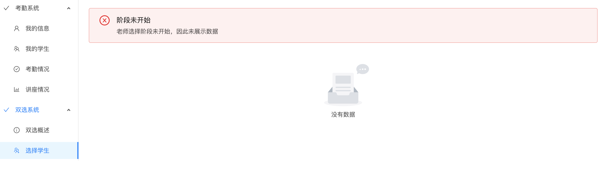

# 使用手册--考勤系统/双选系统 导师端

## 登录系统
请输入登录账号和密码登录系统。

登录成功后，将会自动进入到导师界面。导师端界面包括两个部分，第一部分是考勤系统，第二部分是双选系统。

## 修改密码、登出

修改密码和登出功能位于界面右上角的图标下拉栏中：

目前，修改密码不需要验证已有的密码，要求的新密码规则为8～20个字符。

如果您确实忘记了密码，请联系相关工作人员对您的账号密码进行重置。重置后，请尽快登录系统修改您的密码。

## 考勤系统

### 主页-信息页面

在这个信息界面中，你可以修改联系邮箱，个人主页以及研究领域。修改完后，请点击右下角的“更新”按钮上传数据。当然，这些信息都不是必要的。

### 我的学生

该界面中包含了考勤系统中所有您的学生，以及列出了这些学生最新一次的考勤记录。注意，在双选的时候，除非双选已经结束（并且数据同步到考勤系统中），否则新增的学生不会显示在此界面。

### 考勤管理

在该界面中，您可以通过上方的选择栏选择特定的学生，查看他们所有的考勤情况。

### 讲座情况

在该界面中，您可以查看所有记录在考勤系统中的所有讲座。

## 双选系统

## 主页-双选概述
在新版系统中，老师除了可以查看双选当前的阶段外，还可以查看已选/可选学生的数量。如下图所示：

在该界面中，最上方描述了当前双选的阶段，为学生上传资料阶段，紧接着是该阶段预期的开始时间和终止时间。然后，下方的两个表格详细说明了您可以选择的学生数量。

## 双选阶段说明

在新系统中，整个双选阶段流程简介如下：

双选将会分为若干个阶段：
1. 学生上传资料阶段
2. 学生选择导师阶段
3. 导师选择学生阶段
4. 双选结束

在第一阶段和第二阶段中，由于老师不需要任何选择操作，因此系统不会显示学生信息。此时，您查看“选择学生”栏目时，将会出现以下情况：

上图表明当前还没到导师选择阶段。

学生在第二阶段，即“学生选择导师阶段”中，将会选择最多3个志愿导师。导师在第三阶段，即“导师选择学生阶段”中，将会**分为3次选择**。在第一次选择中，将会列出将您设置为“第一志愿老师”的学生供您选择，同样的，在第二次选择中，将会列出将您设置为“第二志愿老师”的学生。以此类推。

需要注意的是，如果该学生在前面的选择中被其他导师选择了，那么就不会在后续的选择中出现。例如，小张同学的第一志愿选择了老师A，第二志愿选择了您，而老师A在第一次选择中选择了小张，那么在第二次选择中，您的“可选学生列表”就不会出现小张同学（因为已经被其他老师选择了）。

另外请注意，您可选的学生与您限选的名额有关。当您使用了所有限选的名额后，您就不可以继续选择该类别的学生了。