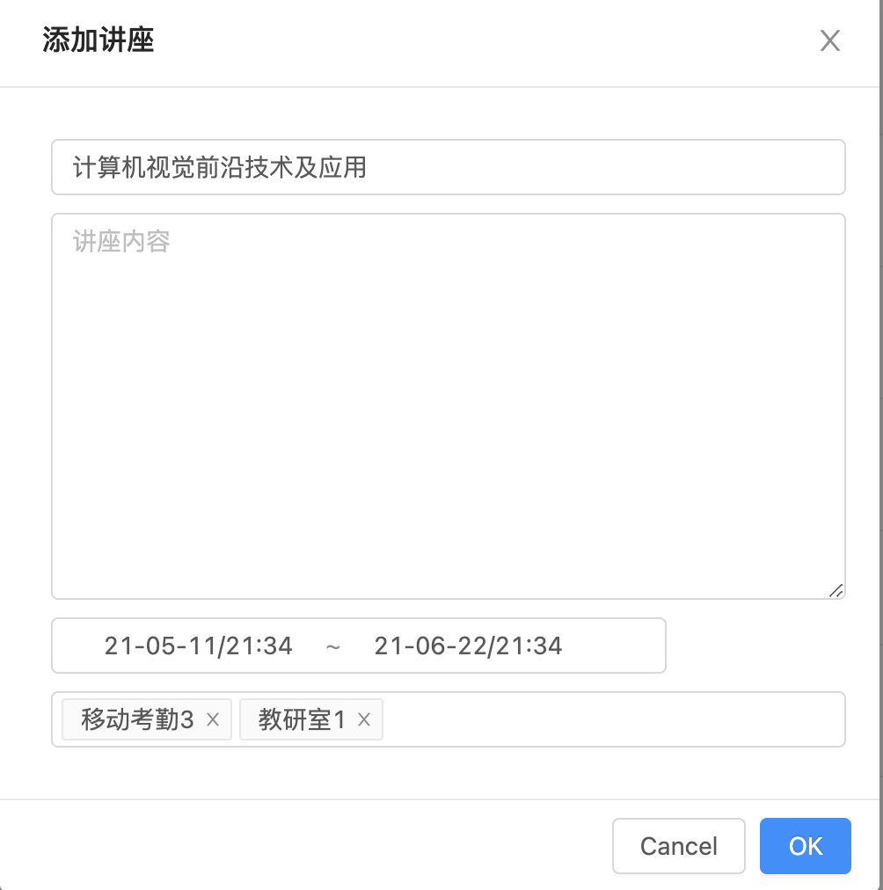

# 使用手册--考勤管理员端

## 职责说明
1. 考勤管理员负责管理所有加入到考勤系统的学生``Student``的信息，这些学生是在双选结束后加入到考勤系统当中的（如何加入考勤系统则是由双选系统负责，考勤系统可以忽略这一步）。在考勤系统中，考勤管理员可以添加学生（单个添加、批量添加）、修改学生信息、删除学生。
2. 考勤管理员可以添加老师、修改老师的相关信息，修改密码（统一修改所有老师的密码，或修改单个老师的密码），查看某个老师的所有学生，或者删除某个老师。
3. 另外，考勤管理员主要负责是“录入讲座，有必要时对考勤的学生进行补签登记”，详细说明如下：
   1. 每个讲座``Lecture``都会有一个或多个打卡位置``Position``与其对应
   2. 讲座会有开始时间和结束时间
   3. 学生在讲座的时间中，通过某个打卡机打卡后，该打卡记录会存放到学院的指纹机数据库中。考勤系统将会每10分钟拉取指纹机数据，得到学生的打卡记录，并且记录到考勤记录中``Record``
   4. 当系统检测到学生的考勤时间、地点与某个讲座匹配时，将会认为这次考勤记录是针对讲座的，否则就认为这次考勤记录只是一个“日常考勤”。
   5. 考勤管理员需要提前录入讲座信息，并且当学生忘记签到（例如，学生忘记打卡等诸多情况）时，为学生补签这次考勤

## 详细操作说明

### 学生界面
1. 查看所有学生信息
   
   可以直接在“学生信息”栏目中查看学生列表

   

   如上图所示，考勤管理员可以修改该学生的密码（无需验证当前的密码），修改该学生的信息（即姓名、学号、联系邮箱），或者删除这个学生。

   **注意**，删除学生将会导致该学生对应的老师的“学生列表”中丢失这个学生，并且该学生的所有考勤记录将会被系统清除。
2. 添加学生
   
    一般情况下，考勤管理员无需对学生进行添加操作。如果确实需要，请点击学生页面上方的“添加学生”或“批量添加”按钮以添加学生，并按照指引操作。添加学生需要准备的内容有：
    1. 登录账号（一般为学号）
    2. 登录密码（简单为主，但是在新建账号后，请告知学生**尽快登录系统修改密码**）
    3. 姓名、学号、邮箱
    4. 该学生对应的老师的**登录账号**，你可以进入到“老师信息”界面查看对应老师的登录账号。

### 老师界面

1. 查看所有老师信息
  
    可以直接在“老师信息”栏目中查看所有老师，并且对老师的信息进行更改。

2. 重设老师的密码

    在很多情况下，管理员需要为老师重设密码。在考勤管理中，一般只需要对一个老师进行重设，而不需要用到批量重设密码功能。请注意，为老师重设密码可以简单为主，并且告知老师**尽快登录系统修改密码**

### 位置管理
位置包含了该位置指纹机的设备号，以及该位置的描述符（如：软件东门），目前系统中已经有已有的位置信息，一般不需要再进行修改。

设备号可以联络指纹机相关负责人员进行查询。

### 讲座管理

考勤管理员日常工作就是添加讲座。

一个讲座包括的内容有：

1. 标题
2. 内容（可以为空）
3. 初始时间～结束时间
4. 一个或多个讲座位置

在讲座管理页面可以添加讲座，如下图为例：

讲座可以删除，但是一般不删。如果删除，将会导致学生的所有考勤记录被记录为“日常考勤”。但是可以重新添加讲座来修复考勤记录。

### 考勤补签

考勤管理员可以在“考勤管理”中看到所有考勤记录。

在某些时候，我们需要对考勤进行补签，可以点击上方的“学生补签”按钮进行补签。补签时候只需要指定学生的**登录账号**、讲座标题以及签到位置即可，不需要指定签到时间。

## 其他与运维有关而无法直接通过系统操作的问题

下面的内容无法在考勤系统中完成，但是在实际运行中可能出现。如果出现了，请联系后台运维负责人。

1. 添加或修改学生和老师的关系
2. 批量导入老师

// TODO：请在这里增添项目
